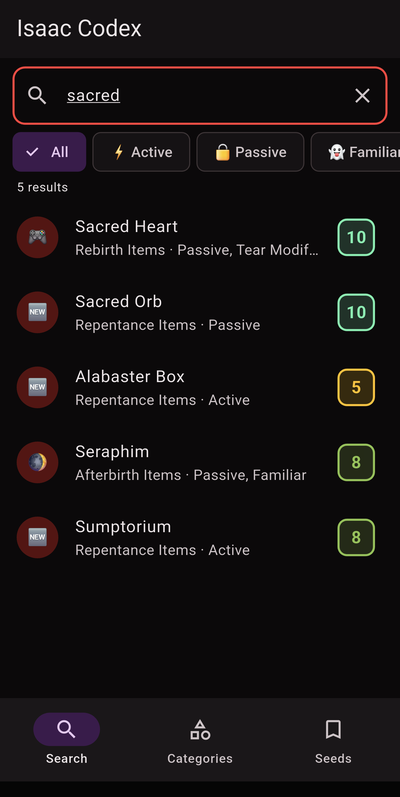
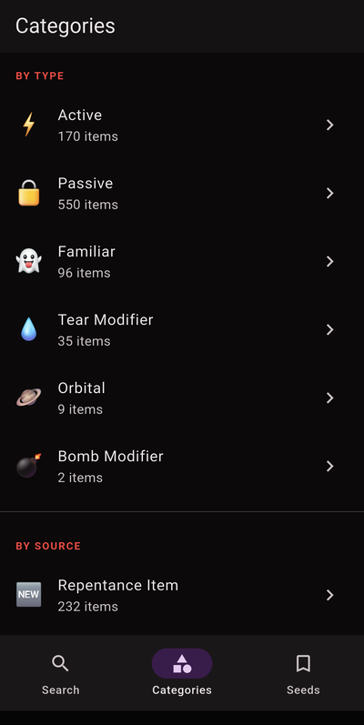
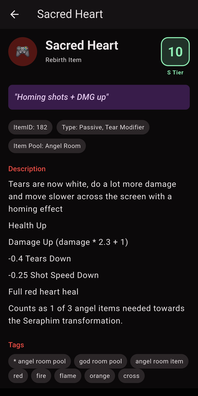
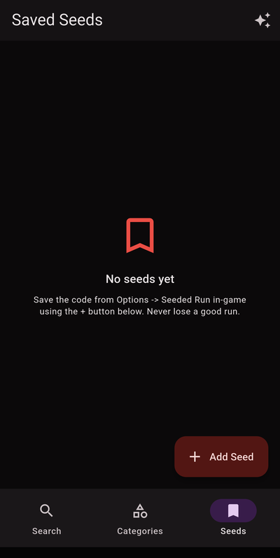

# Isaac Codex

An unofficial companion app for **The Binding of Isaac: Repentance**. Browse the full
item database offline, search by name or effect, and keep a list of your favourite seeds.
Built with Flutter.

**Live web version: [ceressa.github.io/isaac-codex](https://ceressa.github.io/isaac-codex/)**

> Unofficial fan project. Not affiliated with, endorsed by, or sponsored by Nicalis, Inc.
> or Edmund McMillen.

## Screenshots

<p align="center">
  
  
  
  
</p>

## Features

- **Search** - find items, trinkets, cards and consumables by name or effect text
- **Visual search** - a grid of every item sprite; recognise an item by how it looks
  (handy when you are standing on a pedestal and do not know what you just found)
- **Categories** - browse everything grouped (Rebirth / Afterbirth / Afterbirth+ / Repentance
  items, trinkets, cards, consumables)
- **Item detail** - quality, pickup method, in-game ID and the full effect description
- **Seed tracker** - save your own seeds locally, plus a set of curated preset seeds to try
- Dark, Isaac-flavoured Material 3 theme, fully offline (all data is bundled)

## Data & attribution

Item data (1000+ entries) and the item **sprites** are sourced from
[Platinum God](https://platinumgod.co.uk/repentance), the community item reference for
The Binding of Isaac. The sprites are the game's pixel art and, like all item names,
descriptions and game content, remain the property of Nicalis, Inc. / Edmund McMillen.
They are included here only as a non-commercial fan reference. Huge thanks to the Platinum
God contributors; if you are a rights holder and want content removed, open an issue.

The `scraper/` folder contains the Python scripts that build `assets/data/items.json`
(`scrape.py`) and slice the per-item sprites into `assets/sprites/` (`fetch_sprites.py`).

> Note: the app interface is currently in Turkish. Item text is in English (from the source).

## Tech

- Flutter (Material 3, dark theme)
- `shared_preferences` for saved seeds
- No backend, no tracking, works fully offline

## Run

```bash
flutter pub get
flutter run
```

## Disclaimer

The Binding of Isaac and all related names, artwork and content are trademarks and copyright
of Nicalis, Inc. and Edmund McMillen. This is a non-commercial, fan-made reference tool and is
not affiliated with the official product. Item data is provided by Platinum God; if you are a
rights holder and would like content removed, please open an issue.

## License

The application **source code** is released under the [MIT License](LICENSE). The MIT license
covers the code only, not the bundled game data, which remains the property of its respective
owners.
